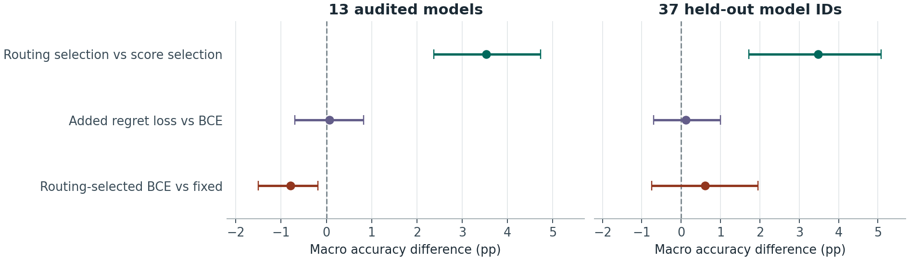
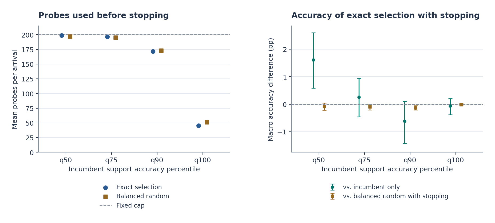
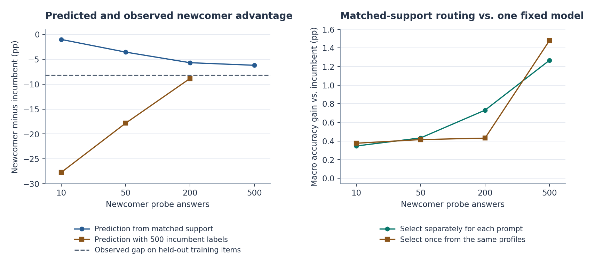
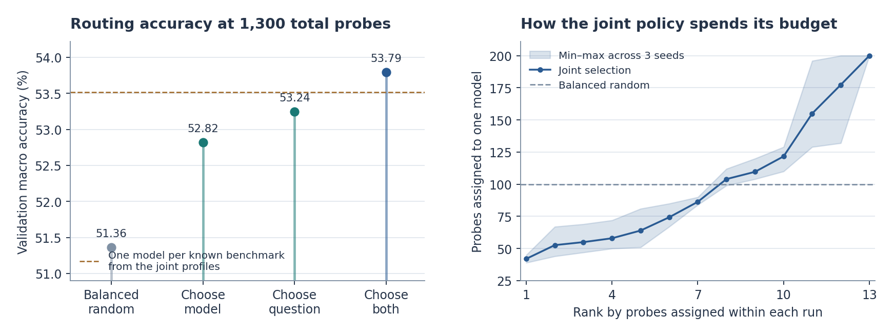
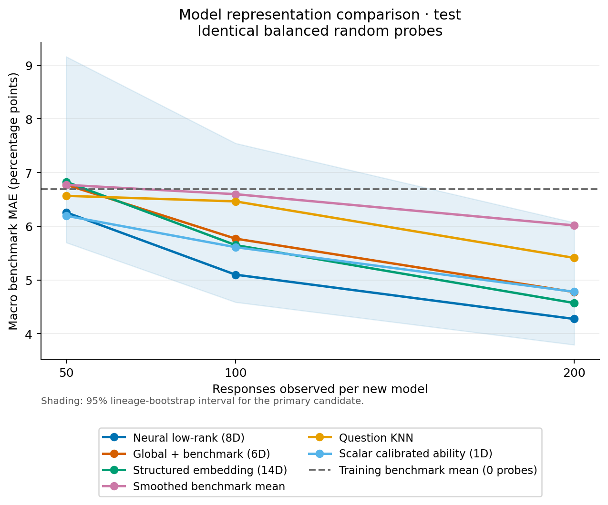
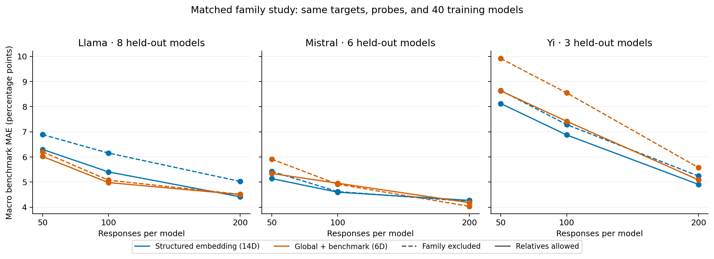
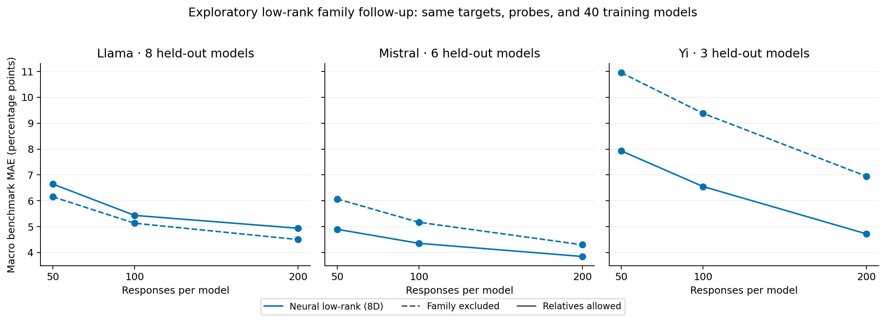

# Efficient LLM Routing with Compact Model Embeddings

NYCU Deep Learning Practice, Group 11. Routing study date 2026-11-15 (Taipei). Secondary benchmark-score study date 2026-10-28. Fixed reference [EmbedLLM: Learning Compact Representations of Large Language Models, ICLR 2025](https://openreview.net/forum?id=Fs9EabmQrJ).

## Executive summary

Building on EmbedLLM, this project freezes a shared decoder and fits each new model's eight-dimensional embedding from labeled answers. It can choose which probes to ask and when to stop. For each incoming prompt, the router selects one model to answer.

Selecting the decoder checkpoint by validation routing accuracy over benchmark-score MAE gave the study's clear controlled advance. At 200 probes, it raised test macro accuracy by +3.53 and +3.48 percentage points (pp) on the 13-model and 37-model historical cohorts, and +2.00 pp on external LLMRouterBench. Adding softmax regret had little effect (+0.06 and +0.12 pp), and strongest fixed alternatives often matched or beat the router.

None of the active probing, stopping, or allocation heuristics showed dependable gains over simpler baselines. Against the strong incumbent, adaptive stopping used 77.3% fewer probes than the 200-probe cap with 0.47% newcomer routing. Across three other support-selected incumbents, it saved 5.5% of probes, and exact probe selection scored -0.10 pp versus balanced-random stopping. On independent xRouteBench, active and random stopping both halted after the same 10-probe warmup, giving no proven active efficiency benefit. Across 13 validation newcomers without an incumbent, joint allocation gained +2.43 pp over equal 1,300-probe random probing and +0.27 pp (interval crossing zero) over same-evidence per-benchmark fixed selection.

A real local GPU demo on ARC-Challenge verified end-to-end operation across two small models. Adaptive onboarding stopped after 19 probes, and independent routing made 24 one-call dispatches that all chose the incumbent, providing proof of operation without establishing routing accuracy.

Benchmark-score prediction was secondary, with 8D embeddings lowering macro MAE from 6.26 to 4.27 pp from 50 to 200 probes. Offline runs replay historical labels with no live calls, paired intervals condition on fixed rosters and draws, the 37-model cohort is retrospective, and joint allocation is validation-only.

## Routing protocol and information boundaries

Routing reuses the frozen `main_v2` `neural_lowrank` 8D decoder (`sigmoid(offset(question) + feature(question)^T model_embedding)`), trained on 62 historical models and 15,733 support questions. Legacy hyperparameter selection used 13 validation models and 3,372 validation queries to minimize cold-start score MAE. Onboarding never refits the shared decoder. For each held-out model, Newton's method solves the convex MAP problem to fit only that candidate's 8D vector from nested balanced-random sets of 50, 100, or 200 binary probe answers across seeds 11, 23, and 37. Every query independently scores all pool embeddings and selects one candidate before reading target correctness, using released binary labels strictly for offline replay scoring.

We evaluate two protocols on the same 3,370 unseen test question groups across `LogiQA`, `MMLU`, `MathQA`, `MedMCQA`, and `TruthfulQA` in [the routing runner](../scripts/run_routing.py) and [the validation record](routing/validation_selection.json).

1. **Simultaneous all-unseen pool** places all 13 held-out candidates together (650, 1,300, or 2,600 total probe responses across the pool, plus a 15,733-probe full-support comparator totaling 204,529 responses). The router picks the `argmax` predicted correctness per query and compares against same-budget `fixed_candidate` (highest probe macro accuracy, lowest-ID tiebreak), `domain_probe_mean`, `question_knn`, `uniform_zero_probe_expected`, `lowest_id_zero_probe`, and a hindsight per-query `oracle`.
2. **Incumbent masking with add-one newcomer** pairs the validation-best training model (`meta-llama__Meta-Llama-3-70B-Instruct`, ID 50, 58.36% validation macro accuracy and 15,733 support responses) against each of the 13 held-out newcomers independently (50, 100, or 200 probe responses per episode, totaling 650, 1,300, or 2,600 across the 13 trials). Validation queries select one probability margin per method and budget from `{0.0, 0.01, 0.025, 0.05, 0.075, 0.1, 0.15, 0.2, 1.0}`, replacing the incumbent only when `p_newcomer - p_incumbent > margin`. The incumbent retains its jointly trained vector while newcomers fit independent MAP vectors, and this leaves estimator asymmetry as a possible influence on score comparison. An **opportunity** occurs when the newcomer answers right and the incumbent answers wrong, a **rescue** occurs when the router switches on an opportunity, and a **harm** occurs when the router switches onto a wrong newcomer against a right incumbent.

Efficiency in this study denotes probe label budget, 8D embedding storage, and one intended downstream model call per query. We perform no live LLM calls and make no deployment cost or latency claims. Because this routing evaluation reuses test models and questions already scored in the benchmark study, it is an exploratory downstream reanalysis even though validation selects all margins and test labels never enter fitting or selection. The 13 test models span only five reviewed lineage groups including nine Llama models, and the paired bootstrap (2,000 draws, seed 8675309) resamples paired queries within benchmark after averaging seeds and add-one trials. Those intervals condition on the fixed candidate roster and support probe draws and leave lineage-robust population bounds unestablished.

## Primary study on cold-start routing

### Simultaneous all-unseen pool

Macro accuracy averages per-benchmark correctness equally across all five benchmarks, and micro accuracy averages across all 3,370 queries. Both hindsight oracle (81.40% macro, 89.61% micro) and uniform expected selection (36.23% macro, 42.66% micro) mark upper and zero-information baselines in [the routing summary](routing/test_summary.csv).

| Router | 50 probes macro / micro (%) | 100 probes macro / micro (%) | 200 probes macro / micro (%) | 15,733 full macro / micro (%) |
| --- | ---: | ---: | ---: | ---: |
| Compact embedding, 8D | 46.41 / 57.62 | 52.70 / 64.07 | 52.72 / 64.11 | 52.53 / 64.10 |
| Fixed probe-best candidate | 50.30 / 60.52 | 54.62 / 65.37 | 54.62 / 65.37 | 54.62 / 65.37 |
| Domain probe mean | 45.23 / 53.81 | 45.66 / 56.96 | 51.27 / 64.54 | — |
| Question KNN | 41.73 / 51.36 | 43.15 / 52.12 | 46.43 / 56.44 | — |
| Lowest-ID zero-probe | 54.62 / 65.37 | 54.62 / 65.37 | 54.62 / 65.37 | 54.62 / 65.37 |

Compact 8D exceeds uniform zero-probe selection (+10.18, +16.46, and +16.49 percentage points) and question KNN (+4.68, +9.55, and +6.29 points), and at 200 probes it leads domain probe mean by +1.45 points (conditional 95% interval [+0.06, +2.97] points). Within-benchmark shuffling that preserves each candidate's per-benchmark selection share yields 45.79%, 51.85%, and 51.94% expected macro accuracy at 50, 100, and 200 probes, putting compact 8D ahead by +0.62, +0.84, and +0.78 percentage points as a descriptive query-matching signal without an interval.

Every few-shot and full-support 8D router still trails `fixed_candidate` by -3.89 points ([-5.17, -2.70]), -1.92 points ([-3.10, -0.76]), -1.90 points ([-2.96, -0.88]), and -2.09 points ([-3.20, -1.08]). Meanwhile, `lowest_id_zero_probe` hits 54.62% only because `ConvexAI__Luminex-34B-v0.1` carries source ID 1 and also achieves the highest test macro accuracy in the 13-model roster. That score reflects source-ID coincidence inside this fixed roster. Candidate selection shares show that at 15,733 probes compact 8D sends 92.19% of queries to `Luminex-34B-v0.1` and 6.25% to `google__gemma-2b-it` (versus 92.58% and 5.72% at 200 probes). Adding 15,533 extra support responses shifts 200-probe macro accuracy by -0.19 points ([-0.78, +0.37]), showing little observed change under this decoder with ordinary unweighted full-support MAP, as [the paired intervals](routing/test_paired.csv) and [the pool selection shares](routing/test_pool_selections.csv) document. The full-support mix places 9,689 of 15,733 responses on MMLU, while balanced 200-probe MAP uses 40 per benchmark, so the comparison also changes likelihood weights by benchmark.

### Held-out model family routing

Using the 8D prediction matrices previously saved by the matched family benchmark-score study, [the family routing replay script](../scripts/score_family_routing.py) retrospectively routes each held-out prompt independently per family roster under both training conditions (`excluded` and `related_allowed`), with no new training or tuning and no claim of an independent benchmark. The Llama, Mistral, and Yi rosters contain 8, 6, and 3 candidate models (all exclusive of those candidate IDs in training), each paired with 40 training slots per arm and 32, 32, and 34 overlapping training models, so permitting relatives exchanges training slots with other models rather than isolating a causal ancestry shift. Both arms share nested balanced-random probe sets of 50, 100, and 200 answers per candidate across 3 seeds (`11`, `23`, and `37`, with `k = 200` primary) and score the same 3,370 unseen query groups with complete binary outcomes across all five benchmarks.

At `k = 200`, `excluded` 8D routing achieves 41.77%, 40.43%, and 54.62% macro accuracy on Llama, Mistral, and Yi, and all three `excluded` minus `related_allowed` paired intervals cross zero at -0.23 ([-1.45, +1.08]), -0.69 ([-1.67, +0.25]), and +0.70 ([-0.42, +1.76]) percentage points (pp). Against the archived domain-mean fixed baseline, `excluded` 8D trails by -1.49 ([-2.93, -0.06]), -1.34 ([-2.63, -0.04]), and -0.50 ([-1.63, +0.71]) pp, where 8D can select candidates by score rank without requiring a known query benchmark while the domain baseline uses the known benchmark. Across the same probes, `excluded` 8D beats same-probe `question_knn` on Llama (+1.96 pp, [+0.25, +3.61]) and Yi (+2.60 pp, [+1.26, +3.89]) while staying close on Mistral (-0.27 pp, [-1.90, +1.38]). All intervals come from within-benchmark paired query-bootstrap draws conditional on the fixed rosters and probe sets using reused historical target labels, as recorded in [the family holdout protocol](routing/family_holdout/protocol.json), [the summary table](routing/family_holdout/summary.csv), [the paired intervals](routing/family_holdout/paired.csv), and [the per-seed breakdown](routing/family_holdout/by_seed.csv).

### Incumbent masking and add-one newcomer rescue versus harm

Across the 13 newcomer trials, `Meta-Llama-3-70B-Instruct` achieves 58.60% macro accuracy (71.57% micro), while pairwise hindsight oracle reaches 65.75% macro (77.56% micro). Individual newcomers create between 176 and 255 opportunities per trial, averaging 201.69 queries out of 3,370.

| Policy | Budget | Margin | Macro / micro (%) | Share (%) | Rescues / trial | Harms / trial | Capture (%) |
| --- | ---: | ---: | ---: | ---: | ---: | ---: | ---: |
| Incumbent only | 0 | — | 58.60 / 71.57 | 0.00 | 0.00 | 0.00 | 0.00 |
| Compact embedding, gated | 50 | 0.075 | 58.51 / 71.42 | 0.66 | 0.79 | 5.87 | 0.39 |
| Compact embedding, gated | 100 | 0.100 | 58.56 / 71.56 | 0.14 | 0.38 | 0.69 | 0.19 |
| Compact embedding, gated | 200 | 0.150 | 58.62 / 71.57 | 0.07 | 0.38 | 0.38 | 0.19 |
| Compact embedding, gated | 15,733 | 0.200 | 58.59 / 71.50 | 1.51 | 3.95 | 6.28 | 1.96 |
| Compact embedding, raw argmax | 50 | 0.000 | 54.73 / 67.15 | 18.55 | 37.31 | 186.31 | 18.50 |
| Compact embedding, raw argmax | 100 | 0.000 | 55.16 / 67.84 | 16.23 | 32.90 | 158.85 | 16.31 |
| Compact embedding, raw argmax | 200 | 0.000 | 56.51 / 69.24 | 13.04 | 26.03 | 104.54 | 12.90 |
| Compact embedding, raw argmax | 15,733 | 0.000 | 57.09 / 69.92 | 12.19 | 26.23 | 81.95 | 13.01 |
| Domain probe mean | 50 | 0.050 | 58.60 / 71.57 | 0.00 | 0.00 | 0.00 | 0.00 |
| Domain probe mean | 100 | 0.025 | 58.55 / 71.56 | 0.09 | 0.13 | 0.44 | 0.06 |
| Domain probe mean | 200 | 0.050 | 58.64 / 71.58 | 0.19 | 0.72 | 0.46 | 0.36 |
| Fixed candidate | 50 | 0.000 | 58.50 / 71.41 | 2.56 | 6.54 | 11.90 | 3.24 |
| Fixed candidate | 100 | 0.000 | 58.60 / 71.57 | 0.00 | 0.00 | 0.00 | 0.00 |
| Fixed candidate | 200 | 0.000 | 58.60 / 71.57 | 0.00 | 0.00 | 0.00 | 0.00 |
| Question KNN | 50 | 0.150 | 58.52 / 71.54 | 0.25 | 0.56 | 1.59 | 0.28 |
| Question KNN | 100 | 1.000 | 58.60 / 71.57 | 0.00 | 0.00 | 0.00 | 0.00 |
| Question KNN | 200 | 0.200 | 58.60 / 71.57 | 0.12 | 0.38 | 0.59 | 0.19 |

Unfiltered `argmax` switching hurts across few-shot budgets, losing 3.87, 3.44, and 2.08 macro percentage points against the incumbent because harmful switches outnumber rescues by four to five times. Validation gating recovers +3.78, +3.40, and +2.11 macro points over raw `argmax` (all conditional 95% intervals exclude zero), including raising the threshold to 1.0 (`incumbent_only`) for 100-probe KNN. Under validation gating, 50 probes shows a small decline of -0.09 points ([-0.11, -0.06]), 100 probes (-0.04 points, [-0.11, +0.03]) and full support (-0.01 points, [-0.08, +0.07]) have intervals crossing zero, and at 200 probes the gated estimate is 0.02 percentage points above the incumbent, with the paired interval crossing zero ([-0.02, +0.06]).

Per-candidate logs show how sparse and asymmetric those switches are. At 50 probes, gated compact 8D loses 183 net correct answers in seed 37 on `TheBloke__tulu-30B-fp16` (26 rescues against 209 harms across 802 selections), driving most of the budget-50 deficit. At 200 probes, only four of 39 seed-by-candidate episodes switch at all (`NousResearch__Nous-Hermes-13b` switches once with zero net change in seed 23), while `Luminex-34B-v0.1` gains +5 net in seed 23 (9 rescues vs. 4 harms), `BioMistral-7B` gains +1 in seed 23 (2 vs. 1), and `google__gemma-2b-it` loses -6 in seed 11 (4 vs. 10). Under `fixed_candidate` at 50 probes, seed 23 switches all 3,370 queries to `Luminex-34B-v0.1` for 255 rescues and 464 harms (-209 net). Full episode counts live in [the add-one candidate log](routing/test_add_one_by_candidate.csv).


*Macro routing accuracy across 50, 100, and 200 balanced-random probes per candidate. The left panel compares four pool routers across all 13 held-out models alongside the full 15,733-probe 8D reference line. The right panel plots add-one macro gain over the Meta-Llama-3-70B-Instruct incumbent under validation margins with 95% paired, conditional query-bootstrap intervals.*

### Single-prompt inference path

For one future prompt, the single-prompt CLI loads a frozen `neural_lowrank` decoder, encodes the prompt with `all-mpnet-base-v2` (or reads a saved `.npy` vector), and computes `latents @ query_design` for every trained ID or fitted `.npz` embedding. Default inference with no `--benchmark` and no positive `--minimum-gain` retains raw interaction `argmax` because the shared question difficulty offset cancels across candidates, and passing `--benchmark` supplies that domain's learned bias for predicted correctness probabilities and optional `--minimum-gain` two-candidate gating. For an incoming prompt with no manually supplied `--benchmark`, passing any positive `--minimum-gain` with exactly two candidates uses the arithmetic mean of learned benchmark biases as the logit offset component (the same fallback as external replay) to compute gating probabilities that remain uncalibrated for arbitrary traffic. The tool prints JSON naming one selected candidate so a caller can dispatch one downstream model call without an intermediate server. On a held-out validation prompt and a 50-probe fitted newcomer, local raw-prompt encoding matched the released feature vector within `5.25e-7` maximum score error and selected the identical model in [the query router](../scripts/route_query.py).

The `fit` subcommand fits a newcomer embedding from score-labeled probes and reuses the same frozen checkpoint across fitting and routing for the routing-selected BCE objective. Passing `--stdin` consumes one nonempty prompt per line and emits one independent JSON choice per line while reusing the decoder and text encoder, as shown in [the README](../README.md). In a `--stdin-json` replay of one historical validation arrival (`q50` incumbent model 3 versus newcomer model 5 under `B` seed 11 with 200 selected archived responses), streaming two selected multiline MathQA validation examples (IDs 31766 and 30337) produced exactly one JSON reply each, routing the first to incumbent DeepSeek-Math-7B-Instruct with scores matching plain `--prompt` and the second to newcomer ConvexAI Luminex-34B v0.2. This is a targeted CLI demonstration using selected validation examples, with no model generation or accuracy estimate.

In a CLI integration replay on one historical 26-answer transcript with [the onboarding CLI](../scripts/onboard_model.py) (`--stdin`), the first reply took `2.35 s`, subsequent replies had a `4.0 ms` median, and `stop` and write took `13.3 ms`, versus `3.53 s` for one fresh CSV-only invocation from a 25-answer prefix. These timings measure one-machine CLI overhead excluding model generation, and both paths achieved bitwise latent equality.

### Live local onboarding and dispatch

Separate from the offline research evaluation that makes no live LLM calls, [the live routing demo script](../scripts/demo_live_routing.py) demonstrates end-to-end local onboarding and query dispatch on a local RTX 5070 Ti (`cuda`) using a pinned `Qwen/Qwen2.5-0.5B-Instruct` incumbent and a pinned `HuggingFaceTB/SmolLM2-360M-Instruct` newcomer. Prompts and official `ARC-Challenge` answer keys come from `allenai/ai2_arc` at a pinned revision, with real deterministic greedy Hugging Face generation where invalid outputs count as wrong. Onboarding runs `120` incumbent support requests across `8` batches, selects from `100` eligible probe prompts alongside `32` separate text-only reference prompts, and fits 8D MAP vectors under the frozen `B` seed `11` checkpoint (`prior_strength = 0.3`) with unknown benchmark mean bias, a `10`-probe warm-up, EVPI tolerance `0.002`, admission margin `0.025`, and a demo cap of `40`. Smooth boundary acquisition stops on EVPI at `0.001496` after sending the newcomer `19` selected requests (`9` beyond warm-up, `5` correct), logged in [the live demo summary](routing/live_demo/demo.json).

All `24` held-out `ARC-Challenge` prompts, filtered to exclude normalized train stem overlap, are routed independently and invoke exactly one actual generator per prompt in [the dispatch log](routing/live_demo/dispatch.csv). All `24` dispatch to the incumbent, yielding `8` correct answers and `7` unparseable responses counted as wrong, so the demonstration confirms end-to-end onboarding and dispatch without establishing routing accuracy or use of both branches. Median local router latency including `all-mpnet-base-v2` text encoding is `8.93 ms`, and median local selected generation latency is `50.74 ms`, excluding downloads, checkpoint loading, and weight initialization from the timer, with both numbers illustrative for one machine and two small models only.

Reproduction uses the existing GPU PyTorch environment documented in [the README](../README.md) with optional `sentence-transformers`, `transformers`, and `pyarrow` packages, retrieving source data and public checkpoints at pinned revisions. Omitting `--run`, `--checkpoint`, and `--learning-selection` reuses local defaults while `--output artifacts/live_demo_reproduction` preserves checked-in files.

```bash
python scripts/demo_live_routing.py --output artifacts/live_demo_reproduction
```

### Checkpoint selection and routing-aware training

Original EmbedLLM learned model-ID embeddings for unseen questions. Our variant freezes a shared 8D `neural_lowrank` decoder to onboard unseen model IDs from few responses, linking [few-observation LLM profiles](https://arxiv.org/abs/2609.37362) with a [softmax expected routing regret](https://arxiv.org/abs/2505.16037) training surrogate. In [the routing-learning study](../scripts/pilot_routing_learning.py), all three arms train 8D embeddings on the 62 historical training models and 15,733 support items across seeds `11`, `23`, and `37`, applying identical inverse-frequency benchmark weights (mean weight 1) and the same balanced 200-probe validation procedure across 13 validation models and 3,372 validation queries (`prior_strength = 0.3`). Each seed runs two fixed 100-epoch trajectories evaluated at the same 51 candidate epochs (epoch `1` and every `2` epochs through `100`). Arm `A` (`A_bce_score_selection`) and arm `B` (`B_bce_routing_selection`) select from one benchmark-macro BCE trajectory by minimum validation macro score MAE versus maximum validation macro routed accuracy. Arm `C` (`C_bce_regret_routing_selection`) adds softmax expected routing regret over 13 sampled training models per minibatch (`lambda = tau = 1.0`) and selects its checkpoint by validation macro routed accuracy.

Test evaluation pools candidate IDs as either the 13 audited test models (`audited_13`) or 37 models (`expanded_37`) combining those 13 with all 24 lineage-uncertain metadata-excluded IDs across the same 3,370 common test question groups. A budget of 200 probes per candidate corresponds to 2,600 probe attempts on `audited_13` and 7,400 on `expanded_37`, and 100 probes acts as a secondary budget (1,300 and 3,700 attempts). Both test pools come from retrospective same-release cohorts with historical partition reuse and provide no lineage-blind evidence for the 24 excluded models. Because the two rosters share queries and 13 candidates, the expansion provides coverage, with no independent replication claim. Same-budget fixed comparators track the single highest-scoring probe model (`support_best_fixed`) and the top predicted model over a disjoint reference bank of 64 support-only prompts per benchmark (`embedding_mean_fixed`, 320 prompts total). Within each seed, both fixed selectors choose the same candidate and coincide on test at 100 and 200 probes (`54.62%` on 13 models and `56.49%` on 37 models) and on validation at 200 probes (`52.92%`), while their chosen candidate can differ across seeds.

| Cohort | Probes | `A` (BCE + MAE) | `B` (BCE + routing) | `C` (BCE+regret + routing) | `support_best_fixed` | `embedding_mean_fixed` |
| --- | ---: | ---: | ---: | ---: | ---: | ---: |
| Validation (13 models) | 100 | 51.54% | 53.94% | 53.94% | 49.37% | 52.92% |
| Validation (13 models) | 200 | 51.60% | 55.16% | 54.61% | 52.92% | 52.92% |
| Audited test (13 models) | 100 | 48.15% | 53.19% | 53.34% | 54.62% | 54.62% |
| Audited test (13 models) | 200 | 50.29% | 53.83% | 53.89% | 54.62% | 54.62% |
| Expanded test (37 models) | 100 | 53.76% | 56.58% | 56.61% | 56.49% | 56.49% |
| Expanded test (37 models) | 200 | 53.61% | 57.09% | 57.21% | 56.49% | 56.49% |

Paired 200-probe contrasts use a within-benchmark paired query bootstrap (2,000 draws after averaging seeds `11`, `23`, and `37`), conditional on the fixed candidate rosters, balanced probe draws, and selected validation checkpoints. Validation routing-accuracy selection (`B - A`) raised test macro accuracy by +3.53 ([+2.38, +4.73]) percentage points (+2.28 micro) on `audited_13` and +3.48 ([+1.72, +5.08]) percentage points (+3.31 micro) on `expanded_37`, with all three seeds positive in both pools. Adding softmax expected regret (`C - B`) shifted macro accuracy by +0.06 ([-0.70, +0.83]) points (-0.04 micro) on `audited_13` and +0.12 ([-0.70, +1.00]) points (-0.94 micro) on `expanded_37`.

Relative to both coinciding fixed comparators at 200 probes, `B - fixed` measured -0.80 ([-1.50, -0.19]) macro points on `audited_13` and +0.61 ([-0.75, +1.95]) on `expanded_37`. Meanwhile `C - fixed` measured -0.73 ([-1.75, +0.16]) on `audited_13` and +0.73 ([-0.74, +2.14]) macro points (-0.20 micro) on `expanded_37`. Both `B` and `C` fell short of the planned +1 percentage-point target over both fixed comparators with a positive paired interval.

At 200 probes in `expanded_37`, [the per-seed test log](routing/learning/test_by_seed.csv) shows that both fixed selectors choose ID 76 in seeds 11 and 23 and ID 49 in seed 37. Across those three seeds, `B - fixed` macro gaps are -1.72, -1.05, and +4.59 percentage points, and `C - fixed` gaps are -0.05, -0.84, and +3.07 points, so the positive mean relies on the third seed. In `audited_13`, `B` routes 97.3–98.0% of queries to the fixed candidate versus 81.5–90.3% for `A`, and that difference primarily reflects better routing choices in this pool, with no demonstrated increase in same-usage within-benchmark matching.

In full 15,733-item support (containing 9,689 `MMLU` prompts), switching arm `B` on `expanded_37` from ordinary unweighted MAP fitting (55.62% macro, 72.65% micro) to equal-weight per-benchmark support (56.74% macro, 68.91% micro) shifted test accuracy by +1.12 ([-0.39, +2.78]) macro points and -3.74 micro points. Full summary tables and paired bootstrap intervals live in [the validation learning summary](routing/learning/validation_summary.csv), [the test learning summary](routing/learning/test_summary.csv), and [the paired test comparisons](routing/learning/test_paired.csv).



*Test macro accuracy differences at 200 probes per candidate on the 13 audited and 37 held-out model pools, with paired 95% query-bootstrap intervals conditional on the candidate roster, seeds, and selected checkpoints.*

Optional two-step reproduction defaults to `--run artifacts/main_v2`, `--checkpoints artifacts/routing_learning`, and `--output reports/routing/learning`. Users on a fresh clone can pass `--run` pointing to a freshly trained run such as `artifacts/reproduction` alongside separate `--checkpoints` and `--output` paths to keep checked-in reports unchanged.

```bash
python scripts/pilot_routing_learning.py --phase train_validate
python scripts/pilot_routing_learning.py --phase test
```

### External transfer evaluation on LLMRouterBench

External transfer evaluates the official LLMRouterBench JSON-results archive (`NPULH/LLMRouterBench`, revision `b95870f9e60c589e82f7972c91ffa8de9ca89f85`) across all 20 performance-roster model IDs with complete original binary grades. These model IDs are absent from EmbedLLM by normalized literal alias, while weight-family overlap remains possible. Matching Unicode NFKC casefolded word and math-operator tokens against raw EmbedLLM prompts and extracted stems removes 588 of 1,001 MMLU-Pro stems and all 198 GPQA stems, so the evaluation uses predesignated KORBench alongside MMLU-Pro and BBH while undetected paraphrases may remain. Deduplicating 21 BBH and 65 KORBench stems leaves 2,657 question groups split into 1,327 support groups and 1,330 query groups (`207` MMLU-Pro, `530` BBH, and `593` KORBench) in [LLMRouterBench](https://github.com/ynulihao/LLMRouterBench), [Hugging Face](https://huggingface.co/datasets/NPULH/LLMRouterBench), [the external protocol](routing/external_transfer/protocol.json), and [the external routing script](../scripts/run_external_routing.py).

Frozen `A` and `B` checkpoints across seeds `11`, `23`, and `37` transfer with zero external training or selection under `100` and `200` nested model-shared balanced-random probes per candidate (`2,000` and `4,000` responses per roster). Unknown benchmark offsets add the unweighted mean of all five historical benchmark biases to the frozen learned text difficulty head under the same MAP prior (`prior_strength = 0.3`), and each query scores all 20 fitted embeddings to pick one model before historical labels are scored against same-budget `support_best_fixed`, two arm `embedding_mean_fixed` comparators from a disjoint support reference (`60` prompts per source), `smoothed_domain`, `question_knn`, and hindsight `oracle` (`92.32%` macro). Historical generation prompts differ from encoder features on BBH (final question with choices) and KORBench (query first and task rule, with worked examples stripped). Under the `384`-token `all-mpnet-base-v2` cap, `755` of `1,185` extracted KORBench inputs exceed the cap (`5` long question stems alone), along with `45` MMLU-Pro and `9` BBH full feature inputs, so context loss may impact transfer while making no causal claim in [the prompt audit](routing/external_transfer/prompt_audit.json).

| Policy | 100 probes macro / micro (%) | 200 probes macro / micro (%) |
| --- | ---: | ---: |
| `A` (`A_bce_score_selection`) | 69.78 / 67.29 | 70.60 / 68.77 |
| `B` (`B_bce_routing_selection`) | 72.21 / 70.10 | 72.60 / 71.25 |
| `A` `embedding_mean_fixed` | 72.94 / 71.55 | 73.47 / 72.33 |
| `B` `embedding_mean_fixed` | 73.65 / 72.06 | 73.47 / 72.33 |
| `support_best_fixed` | 74.35 / 72.56 | 74.18 / 72.83 |
| Domain probe mean | 73.95 / 72.16 | 74.44 / 73.13 |
| Question KNN | 73.62 / 72.61 | 74.08 / 72.86 |

At 200 probes, `B` achieves `72.60%` macro (`71.25%` micro) accuracy versus `70.60%` macro (`68.77%` micro) for `A`, yielding a `B - A` gain of `+2.00` macro percentage points (conditional 95% paired interval `[+1.08, +2.93]`, `+2.48` micro points, `2` of `3` seeds positive), while at 100 probes `B - A` reaches `+2.42` macro points (`[+1.31, +3.52]`). At 200 probes, comparators reach `74.18%` macro for `support_best_fixed`, `73.47%` for `B` `embedding_mean_fixed`, `74.44%` for domain probe mean, `74.08%` for question KNN, and `92.32%` for the hindsight oracle, leaving `B - support_best_fixed` at `-1.58` macro points (`[-2.44, -0.74]`) and `B - B embedding_mean_fixed` at `-0.87` macro points (`[-1.56, -0.21]`). This external evidence supports the checkpoint-selection effect here and indicates that the router still trails simple fixed baselines, with zero current real API cost or latency measurements in [the external summary](routing/external_transfer/summary.csv), [the paired external intervals](routing/external_transfer/paired.csv), [the per-benchmark breakdown](routing/external_transfer/by_benchmark.csv), and [the per-seed breakdown](routing/external_transfer/by_seed.csv).

Safe optional reproduction uses the pinned archive placed at `data/raw/llmrouterbench/bench-release.tar.gz` (`1,283,503,080` bytes) with the optional `sentence-transformers` packages already documented in [the README](../README.md). Omitting `--run`, `--checkpoints`, `--learning-selection`, `--audit`, and `--archive` reuses the same checkpoints and protocol (`artifacts/main_v2`, `artifacts/routing_learning/checkpoints`, `reports/routing/learning/selection.json`, and `reports/routing/external_transfer/protocol.json`), while `--output artifacts/llmrouterbench_reproduction` and `--features artifacts/llmrouterbench_reproduction/features.npz` keep checked-in files untouched and `--device cuda` (or `--device cpu` on CPU hosts, as the script passes `--device` directly to `SentenceTransformer`) encodes prompts in [the external routing script](../scripts/run_external_routing.py).

```bash
python scripts/run_external_routing.py --phase prepare --device cuda --features artifacts/llmrouterbench_reproduction/features.npz --output artifacts/llmrouterbench_reproduction
python scripts/run_external_routing.py --phase score --features artifacts/llmrouterbench_reproduction/features.npz --output artifacts/llmrouterbench_reproduction
```

### Sequential question selection and adaptive stopping

We next evaluate choosing both which onboarding questions to ask and when to stop requesting answers across all three routing-selected BCE (`B`) checkpoints (seeds 11, 23, and 37) on the add-one newcomer-versus-incumbent problem. Fixed-budget evaluations in the core studies remain intact as fair controls, and this sequential arm re-fits incumbent ID 50 (`Meta-Llama-3-70B-Instruct`) from all 15,733 historical support items via the same unweighted 8D MAP solver (`prior_strength = 0.3`) used for newcomers, so the incumbent vector differs from the original jointly fitted anchor. True online test replay stops probe requests and MAP refits once the stopping criterion fires, while `sequential_probes_fixed_200` runs separately afterward as a retrospective 200-probe comparator verified to match the online prefix. Matched balanced random (`balanced_random_same_attempts`) fits each arrival at its exact realized probe count using the same 10 shared warm-up probes per seed and the same 500-prompt label-blind support bank. Both question selection and stopping count operate strictly on support data without target texts or target labels during onboarding, exposing only query features at routing time before target labels score outcomes in [the sequential routing runner](../scripts/run_sequential_routing.py), [the sequential validation record](routing/sequential/validation_selection.json), and [the learning selection record](routing/learning/selection.json).

Every newcomer starts from 10 shared balanced warm-up probes per seed (two per benchmark) and advances under deterministic round-robin benchmark quotas up to a cap of 200 probes from 500 candidate support prompts (100 per benchmark), tracked against a disjoint 160-prompt equal-domain support reference bank (32 per benchmark). At each step, the selector pre-screens at most 48 eligible same-domain candidates using a Laplace variance approximation and evaluates up to 8 top-ranked candidates on both hypothetical Bernoulli outcomes (`0` and `1`) using actual warm-started regularized 8D MAP refits, as available same-domain candidates can fall below either bound. The two post-probe reference prediction shifts are centered to zero expectation under the current probe probability, picking the candidate that maximizes centered expected post-probe positive advantage over the incumbent beyond the admission margin while revealing only that single queried answer with zero live ensemble generation. A separate stopping score computes mean approximate expected value of perfect information (EVPI) near the admission margin across the 160 reference questions from the current MAP inverse-Hessian covariance. Posterior EVPI serves as a heuristic conditional on the fitted decoder and Gaussian Laplace approximation, offering no formal accuracy guarantee. Across 13 validation newcomers and 3,372 validation queries, one threshold grid first selects admission margin `0.025` on 200 balanced-random validation probes. Under that fixed margin, the sequential selector is separately continued to 200 probes (`tolerance = 0`), and a second threshold grid then picks EVPI tolerance `0.0003` (62.18 mean probes, 26 median) on those continued trajectories to minimize mean responses subject to at most 0.10 percentage points macro loss relative to running the selector to 200, with zero tuning on test. This design adapts [expected-error-reduction active learning](https://groups.csail.mit.edu/rrg/papers/icml01.pdf) and [knowledge-gradient acquisition](https://doi.org/10.1287/ijoc.1080.0314), alongside [precision-based adaptive stopping](https://arxiv.org/abs/2608.14425) as a close alternative, without claiming novelty over prior active-learning or stopping literature in [the validation summary](routing/sequential/validation_summary.csv), [the validation margin grid](routing/sequential/validation_margin_grid.csv), [the validation tolerance grid](routing/sequential/validation_tolerance_grid.csv), and [the validation paired intervals](routing/sequential/validation_paired.csv).

| Policy | Mean / median probes | Total probes | Macro / micro (%) | Newcomer share (%) | Rescues / harms | Capture (%) | Local CPU (s) |
| --- | ---: | ---: | ---: | ---: | ---: | ---: | ---: |
| Sequential probes + EVPI stop | 45.44 / 14 | 1,772 | 58.5352 / 71.5651 | 0.4664 | 1.95 / 2.21 | 0.97 | 0.128 |
| Sequential probes, fixed 200 | 200.00 / 200 | 7,800 | 58.5030 / 71.5598 | 0.4976 | 2.05 / 2.49 | 1.02 | 0.700 |
| Matched balanced random | 45.44 / 14 | 1,772 | 58.5502 / 71.5643 | 0.5326 | 2.18 / 2.46 | 1.08 | 0.0002 |
| Balanced random 50 | 50.00 / 50 | 1,950 | 58.5286 / 71.5620 | 0.4390 | 1.77 / 2.13 | 0.88 | 0.0002 |
| Balanced random 100 | 100.00 / 100 | 3,900 | 58.5329 / 71.5636 | 0.5159 | 2.03 / 2.33 | 1.00 | 0.0002 |
| Balanced random 200 | 200.00 / 200 | 7,800 | 58.5472 / 71.5651 | 0.5577 | 2.31 / 2.56 | 1.14 | 0.0003 |
| Incumbent only | 0.00 / 0 | 0 | 58.5998 / 71.5727 | 0.0000 | 0.00 / 0.00 | 0.00 | 0.0000 |

Across 13 held-out test IDs and 3 seeds (39 arrivals on 3,370 queries), adaptive onboarding requests a mean of 45.44 probes (median 14, range 10–200), totaling 1,772 requests versus 7,800 at the cap (77.3% fewer). Three arrivals reach the 200-probe cap, 36 stop early at the EVPI threshold while showing at least one reference edge above the admission margin (a heuristic trigger without confidence certification), and zero stop without a positive reference edge (`weak_on_reference = 0`). Conditional 95% paired macro accuracy differences place adaptive +0.0322 pp ([+0.0065, +0.0649]) above the same selector fixed at 200, -0.0150 pp ([-0.0515, +0.0261]) against matched balanced random, and -0.0646 pp ([-0.3845, +0.2066]) against incumbent-only. With 0.4664% newcomer selection share and 1.95 mean rescues versus 2.21 harms across 201.69 opportunities (0.97% capture), these savings occur on an incumbent-dominated setup yielding few additional beneficial queries and zero advantage over balanced random probing at matched depth. Local observed CPU wall-time for the selection and MAP refit algorithm averages 0.128s versus 0.700s at the cap, while variable actual LLM generation time remains unmeasured in [the sequential test summary](routing/sequential/test_summary.csv), [the sequential paired intervals](routing/sequential/test_paired.csv), [the per-arrival log](routing/sequential/test_by_arrival.csv), [the per-benchmark breakdown](routing/sequential/test_by_benchmark.csv), and [the adaptive onboarding figure](routing/sequential/adaptive_onboarding.png).


*Empirical probe-count stops across 39 test arrivals on the left (mean 45.4 probes) and adaptive test macro accuracy differences with conditional 95% paired query-bootstrap intervals on the right, using [the sequential test summary](routing/sequential/test_summary.csv) and [the sequential paired intervals](routing/sequential/test_paired.csv).*

Safe reproduction omits `--run`, `--checkpoints`, `--learning-selection`, and `--incumbent-selection` to reuse the local defaults (`artifacts/main_v2`, `B` checkpoints in `artifacts/routing_learning/checkpoints`, `reports/routing/learning/selection.json`, and `reports/routing/validation_selection.json`), while passing `--output artifacts/sequential_reproduction` keeps checked-in reports unchanged in [the sequential routing script](../scripts/run_sequential_routing.py).

```bash
python scripts/run_sequential_routing.py --phase validation --output artifacts/sequential_reproduction
python scripts/run_sequential_routing.py --phase test --output artifacts/sequential_reproduction
```

For practical onboarding of a new model, [the onboarding CLI](../scripts/onboard_model.py) serves one `next_probe` prompt per step until stopping and writes paired newcomer and incumbent embeddings for gated per-prompt routing with [the query router](../scripts/route_query.py), as documented in [the README](../README.md).

### Conditional adaptive onboarding across incumbent strengths

To evaluate how sequential onboarding behaves across incumbent strengths, we selected four anchor incumbents at rounded support-accuracy ranks `q50`, `q75`, `q90`, and `q100` (ranks 32, 47, 56, and 62 of 62 training models) from equal-benchmark macro scores over the 15,733 support items. Those anchors are ID 3 (`deepseek-ai__deepseek-math-7b-instruct`, 37.62% support macro), ID 92 (`Intel__neural-chat-7b-v3-3`, 42.60%), ID 83 (`SUSTech__SUS-Chat-34B`, 51.31%), and ID 50 (`meta-llama__Meta-Llama-3-70B-Instruct`, 59.00%). All four primary arms share the frozen `B` checkpoints (seeds 11, 23, and 37), admission margin 0.025, heuristic EVPI tolerance 0.0003, full-support 8D MAP incumbent refits (`prior_strength = 0.3`), 10 warm-up probes per seed, and the same disjoint support banks (160 reference and 500 candidate prompts), crossing exact Laplace-screened expected-improvement selection or balanced-random ordering with EVPI stopping or the 200-probe cap. Each anchor faces the 13 test newcomers across 3 seeds (39 arrivals per anchor on 3,370 queries), reusing historical test labels strictly for offline replay scoring with within-benchmark paired query-bootstrap intervals (2,000 draws) conditional on the fixed candidate rosters, anchors, seeds, and support banks in [the competitive onboarding script](../scripts/pilot_competitive_onboarding.py) and [the validation selection record](routing/competitive_onboarding/validation_selection.json).

Across `q50`, `q75`, and `q90` on the 13 validation newcomers (3,372 queries), selecting one shared fixed balanced-random probe count from `{10, 20, 50, 100, 200}` chose 200 (45.12% equal-anchor validation macro accuracy), matching the 200-probe random cap on test. Retrospective same-realized-`k` random fits balanced-random probes at the exact stopping arm's realized count `k` after the fact. Same-evidence fixed identity scores both newcomer and incumbent by equal-benchmark macro mean on the exact-selected probes and routes all queries to whichever leads, a deployable fixed baseline whenever incumbent support outcomes are already known.

| Anchor | Exact probes (mean / total) | Random EVPI probes (mean / total) | Exact cap stops | Exact macro (%) | Random EVPI macro (%) | Incumbent macro (%) | Exact capture (%) |
| --- | ---: | ---: | ---: | ---: | ---: | ---: | ---: |
| `q50`, ID 3 (`deepseek-ai__deepseek-math-7b-instruct`) | 198.90 / 7,757 | 196.92 / 7,680 | 37/39 | 39.3992 | 39.4809 | 37.7903 | 21.59 |
| `q75`, ID 92 (`Intel__neural-chat-7b-v3-3`) | 196.46 / 7,662 | 195.26 / 7,615 | 37/39 | 44.1239 | 44.2170 | 43.8610 | 20.28 |
| `q90`, ID 83 (`SUSTech__SUS-Chat-34B`) | 171.79 / 6,700 | 173.08 / 6,750 | 26/39 | 53.3909 | 53.5201 | 54.0054 | 3.25 |
| `q100`, ID 50 (`meta-llama__Meta-Llama-3-70B-Instruct`) | 45.44 / 1,772 | 51.36 / 2,003 | 3/39 | 58.5352 | 58.5502 | 58.5998 | 0.97 |



Across these four chosen incumbents, lower probe counts associate with higher incumbent support accuracy. At `q100`, exact stopping reproduces the prior sequential run (1,772 exact probes, median 14, 36 early stops, and 3 cap stops). Across `q50`, `q75`, and `q90`, most exact arrivals hit the 200-probe cap (37/39, 37/39, and 26/39, median 200 on each), averaging 189.05 exact probes (22,119 vs. 23,400, 5.5% fewer than the cap) compared with 188.42 (22,045) for balanced-random EVPI stopping.

On the three-anchor competitive average, exact selection trails balanced-random EVPI stopping by -0.10 pp (conditional 95% interval [-0.18, -0.04], 0/3 seeds positive) and retrospective same-`k` random by -0.10 pp ([-0.17, -0.04]). Exact EVPI stopping differs from exact 200-cap selection by +0.006 pp ([-0.004, +0.020]) and trails deployable same-evidence fixed identity by -0.33 pp ([-0.75, +0.07]). Against keeping the incumbent, exact EVPI stopping averages +0.42 pp ([-0.09, +0.92]), gaining +1.61 pp ([+0.59, +2.60]) at `q50` while its intervals cross zero at `q75` (+0.26 pp, [-0.46, +0.94]) and `q90` (-0.61 pp, [-1.43, +0.10]). Selection plus MAP CPU runtime averages 0.67s per arrival for exact selection versus 0.044s for balanced-random EVPI stopping across the competitive anchors, with zero live LLM requests made in [the competitive test summary](routing/competitive_onboarding/test_summary.csv), [the competitive paired intervals](routing/competitive_onboarding/test_paired.csv), and [the competitive arrival log](routing/competitive_onboarding/test_by_arrival.csv).

Reproducing the competitive-anchor comparison runs validation before test using the default frozen checkpoints and sequential thresholds (or custom `--output` and `--trace-output` paths to preserve checked-in files) in [the competitive onboarding script](../scripts/pilot_competitive_onboarding.py).

```bash
python scripts/pilot_competitive_onboarding.py --phase validation
python scripts/pilot_competitive_onboarding.py --phase test
```

### Validation pilot with smooth probe acquisition

We ran a development-only validation pilot testing smooth decision-boundary probe acquisition under the frozen routing-selected `B` checkpoints (seeds 11, 23, and 37), admission margin `0.025`, 10 shared balanced warm-up probes, a 200-probe cap, and 48-prompt same-domain shortlists drawn under round-robin domain quotas across the 13 validation newcomers and 3,372 validation queries. Rather than running hypothetical two-outcome MAP solves on shortlisted prompts, each step applies one rank-one Fisher information update and averages $\Delta \mathrm{Var}(g) \cdot \varphi(g / s) / (2 s)$ across the 160 reference prompts, where $g = p_{\text{new}} - p_{\text{incumbent}} - 0.025$ is the predicted newcomer-minus-incumbent probability gap beyond the margin, $s$ is its Laplace standard deviation, $\Delta \mathrm{Var}(g)$ is the rank-one predicted variance reduction from the candidate probe, and $\varphi$ is the standard normal density. Weighting by $\varphi(g / s) / (2 s)$ concentrates acquisition on variance reductions where $g$ sits near the routing margin, and the runner performs one warm-started 8D MAP refit on each actually observed answer in [the smooth probe pilot script](../scripts/pilot_smooth_probe.py) and [the smooth probe protocol](routing/smooth_probe/protocol.json).

Evaluation targets the three competitive incumbent anchors (`q50` ID 3, `q75` ID 92, and `q90` ID 83) alongside the strongest anchor `q100` (ID 50) as context. On the unweighted `q50`/`q75`/`q90` mean, a predeclared validation gate required at least 10% fewer probes than validation-selected balanced-random 200, competitive mean macro loss no greater than 0.10 pp, and each competitive anchor no worse than -0.25 pp as point estimates. Sweeping the EVPI threshold grid (`0.0003` to `0.004`) on validation only selected `0.002` for both smooth acquisition and balanced random in [the stopping grid log](routing/smooth_probe/validation_stop_grid.csv). Across `q50`, `q75`, and `q90`, smooth acquisition asks 97.16 mean probes versus 114.12 for balanced random under the same stopping rule and 200 fixed probes, while conditional 95% paired intervals place smooth +0.0876 pp ([+0.0181, +0.1598]) versus adaptive balanced random and +0.0332 pp ([-0.0515, +0.1195]) versus balanced-random 200, with smooth trailing balanced-random 200 at `q90` by -0.1462 pp ([-0.2751, -0.0191]) in [the smooth paired intervals](routing/smooth_probe/validation_paired.csv).

At the 200-probe cap across the competitive anchors, exact two-outcome lookahead consumed 0.710s local CPU time per arrival versus 0.057s for smooth acquisition (0.0565s to 0.0588s across all four anchors), excluding query scoring or LLM generation in [the smooth validation summary](routing/smooth_probe/validation_summary.csv). Because this pilot is development-only, the paired intervals are conditional on the fixed candidate roster, seeds, arrivals, and shared validation episodes and evaluate the same validation data used for threshold selection, so generalization requires independent data.

### External transfer test on xRouteBench

To test frozen adaptive onboarding on independent benchmarks, we evaluate the official `train` and `test` partitions of `xRouteBench` (revision `ea4b6e1b29d9a734f55f0a637baf326bad6aa681`) across five binary-scored tasks (`ARC-Challenge`, `BoolQ`, `CommonsenseQA`, `HellaSwag`, and `OpenBookQA`). Dropping groups with repeated model rows, differing user queries, or `xRouteBench` train-to-test stem overlaps retains `2,098` of `2,099` training groups and `1,141` of `1,148` test groups, while normalized stem and stripped-prompt comparisons find zero EmbedLLM matches. Removing three exact known model aliases from the 18-model source roster (`llama3-70b-instruct` for EmbedLLM model 50, `llama-3-8b-instruct-lite` for model 64, and `qwen2.5-7b-instruct-turbo` sharing the `qwen2.5-7b-instruct` backbone) leaves `15` eligible deployment names, though overlapping lineages and model identities across prior or other releases remain possible in [xRouteBench](https://huggingface.co/datasets/ulab-ai/xRouteBench).

Ranking those 15 deployments by equal-task macro accuracy on the 2,098 retained training groups picks per-quantile incumbents `gpt-oss-20b` at `q50` (83.72%), `llama-4-maverick` at `q75` (88.08%), and `cogito-v2-1-671b` at `q90` (88.29%) as the primary anchors, with `qwen3-next-80b-a3b-instruct` at `q100` (88.82%) as context only and each incumbent fitted from the full retained external training bank. Each anchor faces the remaining 14 deployments across all three frozen `B` seeds (11, 23, and 37), producing 42 arrivals per anchor, 126 primary arrivals, and 168 total arrivals under frozen validation settings with zero external tuning (10-probe minimum warm-up, 200-probe cap, `0.025` admission margin, and `0.002` EVPI tolerance). Unknown-domain offsets add the mean of the five frozen EmbedLLM benchmark biases to the learned difficulty head, test preparation excludes labels, and target scoring runs once against two predeclared joint gates on the primary average requiring at least 10% fewer probes than balanced-random stopping (`random_own_stop`) and a conditional 95% macro lower bound of at least `-0.5` percentage points against 200-probe balanced random (`random_fixed_200`) in [the xRouteBench protocol](routing/xroute_onboarding/protocol.json).

In test replay, all 168 episodes (126 primary) in both `smooth_own_stop` and `random_own_stop` halted immediately after the 10 identical balanced warm-up probes and produced identical choices, so the post-warmup question selector never ran, probe savings were `0%` against `random_own_stop` (`10.0` vs. `10.0` mean probes), and the test failed the joint criterion without verifying question acquisition. On the primary `q50`/`q75`/`q90` average, `smooth_own_stop` reaches `87.99%` macro accuracy (`92.48%` micro) versus `88.03%` (`92.49%` micro) for the zero-probe incumbent (`-0.0381` percentage points, `[-0.1143, 0]`), recording `0` rescues against `12` harms and `0.058%` newcomer assignment. Meanwhile `random_fixed_200` gives effectively the same quality (paired lower 95% bound `-0.00128` pp), and the same-10-evidence fixed-identity baseline averages `88.11%` macro and `92.22%` micro accuracy against `87.99%` macro and `92.48%` micro for adaptive stopping in [the xRouteBench summary](routing/xroute_onboarding/test_summary.csv), [the xRouteBench paired intervals](routing/xroute_onboarding/test_paired.csv), and [the xRouteBench criterion record](routing/xroute_onboarding/test_criterion.json).

Optional reproduction places the `train`, `test`, and `llm_candidates` train parquet files from the pinned Hugging Face release under `data/raw/xroutebench` (`train.parquet`, `test.parquet`, and `models.parquet`) and reuses local frozen defaults while passing custom `--features` and `--output` paths to preserve checked-in files and `--device` for `cuda` or `cpu` encoding in [the xRouteBench onboarding script](../scripts/run_xroute_onboarding.py).

```bash
python scripts/run_xroute_onboarding.py --stage prepare --device cuda --features artifacts/xroute_reproduction/features.npz --output artifacts/xroute_reproduction
python scripts/run_xroute_onboarding.py --stage score --features artifacts/xroute_reproduction/features.npz --output artifacts/xroute_reproduction
```

### Why few-probe admission collapsed

A post-test mechanism diagnostic examines `xRouteBench` official `train` alone, using zero official test cases or labels, across the same frozen `B` checkpoints (seeds 11, 23, and 37), 500 candidate questions from source `train`, 160 separate reference texts for same-fit fixed identity, and the 1,438 remaining official `train` questions for measurement in [the profile diagnostic script](../scripts/diagnose_xroute_profiles.py) and [the training diagnostic summary](routing/xroute_onboarding/train_profile_diagnostic.csv). This assay refits the incumbent from the 500 candidate labels, using a smaller incumbent support budget than the 2,098-item incumbent fit in the earlier external transfer. It compares a newcomer fitted on 10, 50, or 200 shared balanced-random questions against an incumbent estimator fitted on 500 labels, alongside identical prefixes of 10, 50, 200, and 500 questions for both models.

With the `q50` incumbent (`gpt-oss-20b`), the actual mean newcomer-minus-incumbent gap is -8.21 pp with +7.41 pp oracle rescue opportunity, and asymmetric scoring predicts -27.72 pp with 0.53% admitted after 10 probes and -8.88 pp after 200. Matching support at 10 probes shifts the predicted gap to -1.03 pp and admission to 11.69%, giving +0.35 pp for the router over the incumbent and +0.38 pp for same-fit reference-static selection. At 500 probes for both, the router gains +1.27 pp versus +1.48 pp for same-fit static selection, making the +0.73 versus +0.43 pp pair at 200 matched probes an isolated point comparison alongside -0.04 to -0.46 pp matched routed gains across `q75`, `q90`, and `q100`. Budget asymmetry depresses early newcomer scores in this setting, matching support can overcorrect, and higher admission rates leave an uncertain contextual advantage. This diagnostic is exploratory, with no target rescore and no proof of causality for other settings.



*xRouteBench q50 incumbent, using the official training split only.*

### Can an 8D profile separate prompt-level strengths?

A source validation-only headroom comparison tests whether an 8D profile can separate prompt-level strengths across all 13 validation newcomers, the `q50`, `q75`, and `q90` selected incumbents (`q100` as context), 3,372 validation queries, 500 paired balanced candidate labels, and 160 disjoint reference prompts in [the paired routing script](../scripts/diagnose_paired_routing.py) and [the paired routing protocol](routing/paired_routing/protocol.json). Across `q50`, `q75`, and `q90`, a query-level pair oracle beats the hindsight best fixed model by +11.72, +10.50, and +8.13 percentage points, though that ceiling relies on the realized answers. To measure how much of that headroom linear 8D profiles capture, we compare frozen `B` checkpoints across three seeds (`11`, `23`, and `37`), using the top 7 standardized principal directions from the `B` interaction design plus an unpenalized intercept, against one deterministic supervised linear 7D query map trained via weighted reduced-rank ridge on the 62×15,733 historical item response table (mean-centered over models and prompts with equal-benchmark weights, then standardized on the support bank with an unpenalized intercept). Both representations apply the same 8D paired ridge adaptation (sum-of-squares ridge penalty `50.0`, `0.025` margin) directly to the signed correctness difference $y_{\text{new}} - y_{\text{inc}}$.

Under frozen `B`, paired ridge routing gives paired macro differences against reference-static selection (with conditional 95% paired query-bootstrap intervals) of +0.136 ([-0.296, +0.567]), -0.257 ([-0.695, +0.177]), and +0.195 ([-0.205, +0.560]) pp across `q50`, `q75`, and `q90` in [the paired routing summary](routing/paired_routing/summary.csv) and [the paired routing intervals](routing/paired_routing/paired.csv). On the competitive `q50`/`q75`/`q90` average, the deterministic supervised selector gains +0.033 pp ([-0.234, +0.304]) over reference-static selection and sits only +0.0085 average pp above the archived `B` ridge point estimate. Meanwhile, the domain baseline chooses one model per incoming prompt using its known benchmark, without prompt-specific variation within each benchmark, and the supervised selector loses to that per-benchmark paired-support fixed baseline by -0.336 pp ([-0.620, -0.089]), missing the predeclared validation gate.

All estimates stay on the source validation split with no outside outcomes, and the supervised map is strictly deterministic. Because the supervised selector misses the predeclared gate, we ran no new held-out EmbedLLM or `xRouteBench` tests. Taken together, large pair-oracle headroom appears when realized answers are visible, yet linear 8D prompt profiles recover too little within-benchmark signal to beat choosing one model per benchmark.

A nonlinear episodic extension in [pilot_episodic_paired.py](../scripts/pilot_episodic_paired.py) uses a 768→64→7 feature head plus paired intercept, training the head over 1,000 differentiable ridge episodes per seed across 62 historical models with balanced disjoint support and outer questions under within-pair centered MSE. At 200 probes, its competitive `q50`/`q75`/`q90` validation-only difference is -0.0746 pp ([-0.3200, +0.1712]) versus strongest direct support-fixed, -0.0124 pp versus per-benchmark fixed, and +0.0512 pp ([-0.1255, +0.2406]) versus frozen-`B` paired control, trailing strongest reference-fixed at 100 probes by -0.3269 pp ([-0.6066, -0.0496]). Missing the +1 pp development promotion gate, it triggered no held-out evaluation ([paired.csv](routing/episodic_paired/paired.csv), [protocol.json](routing/episodic_paired/protocol.json)).

### Allocate probes across a newcomer pool

We allocate probes across 13 unseen-to-decoder validation arrivals without an incumbent over 3 `B` seeds and 3,372 queries, routing one LLM per prompt ([pilot_pooled_onboarding.py](../scripts/pilot_pooled_onboarding.py), [protocol.json](routing/pooled_onboarding/protocol.json)). Arrivals share 500 candidate and 160 reference texts, 10 warm-up probes each, a 200-probe per-model cap, and fixed horizons of 650, 1,300, and 2,600 probes. On each reference text, an intuitive bound sums every contender's Gaussian positive gain over the current winner using variances of both profiles, upper-bounding potential switch gains. A rank-one Fisher approximation scores each eligible shortlisted model-question pair, queries one answer, and refits only the chosen model.

At 1,300 total probes, joint selection reaches 53.79% macro accuracy versus 51.36% for same-budget round-robin (+2.43 pp [+1.15, +3.78], +4.20 pp micro, 3/3 seeds), though 650-probe round-robin already hits 53.34%. Joint selection (53.79%) differs from same-evidence reference per-benchmark fixed (53.52%) by +0.27 pp ([-0.51, +1.08], -0.04 pp micro) and global reference fixed (52.92%) by +0.87 pp ([-0.07, +1.79]), where the fixed baseline only knows each query's benchmark label and picks one model per benchmark. Joint allocation assigns 39–200 probes per model versus 100 each in round-robin and fails the gate requiring +0.5 pp and a positive interval versus every comparator.



At 1,300 probes, two exploratory matched mechanism cells, choosing prompts with fixed model allocation (+1.88 pp) and choosing models with fixed prompt lists (+1.46 pp) versus archived round-robin, are point differences only. Either mechanism could matter with no ordering certainty, and their direct paired difference is +0.42 pp ([-0.43, +1.31]). No stopping accuracy was computed and no held-out rerun followed ([summary.csv](routing/pooled_onboarding/summary.csv), [paired.csv](routing/pooled_onboarding/paired.csv), [mechanism_contrasts.csv](routing/pooled_onboarding/mechanism_contrasts.csv)).

### Token-cost audit with matched onboarding

An exploratory audit evaluates 1,438 disjoint-from-fitting official `xRouteBench` training queries (items previously summarized, excluding published test data), pairing `q75` incumbent `GPT-OSS-120B` chosen on 500 candidate labels with 14 newcomers across 3 `B` seeds in [pilot_xroute_cost.py](../scripts/pilot_xroute_cost.py). On the same 100 balanced paired responses, two-fold cross-fitting selects `λ` and convex policy choices, while routing picks one model per prompt and one randomized mixture endpoint with incoming task labels known. Decision utility equals estimated accuracy less `λ` times predicted cost from released historical rates, support-only predicted input length, and model-task mean output counts, scored under equal-task weights via archived selected token counts as a billing proxy without actual invoices or current prices. Same-evidence controls span global and per-task convex mixtures, shared-difficulty scalar matched to the `B` mean on 160 unlabeled reference texts, and a domain-length-price model plus the incumbent, requiring a 0.5 pp quality floor below the incumbent and ≥10% savings over the support-selected control. Reaching 87.794% macro accuracy, the router gains +0.125 pp ([+0.059, +0.191]) over the support-selected control at 1.34% higher cost ([1.27%, 1.42%]), saves 4.76% proxy bill at -0.391 pp ([-0.559, -0.233]) versus the incumbent while missing the -0.5 pp lower bound, and differs from the scalar control by -0.026 pp ([-0.050, -0.003]) at 0.58% lower bill. Zero arrivals both saved proxy bill and met that observed quality floor versus the incumbent, leaving no estimated break-even as the frozen gate failed ([summary.csv](routing/xroute_cost/summary.csv), [paired.csv](routing/xroute_cost/paired.csv), [protocol.json](routing/xroute_cost/protocol.json)).

### Validation-only routing-aware probe pilot

We also ran a validation-only active acquisition pilot using the frozen seed-11 `neural_lowrank` decoder, 13 validation newcomers, and 3,372 validation queries. Disjoint support-only banks allocate 32 reference prompts and 100 probe candidates per benchmark (160 reference and 500 candidate prompts total). Every newcomer starts from a common set of 10 balanced warm-up probes and advances with identical round-robin benchmark quotas to budgets 50 and 100 across four arms (`balanced_random`, `score_fisher`, `d_optimal`, and `routing_expected_improvement`) in [the pilot script](../scripts/pilot_routing_acquisition.py).

To score each candidate probe for routing decisions against the incumbent under the fixed 0.10 margin, define the current decision gap on a reference prompt as `d = p_new - p_incumbent - 0.10` and let `gamma` denote the approximate standard deviation of a one-probe posterior-mean update to `p_new` under the Laplace covariance. Following [knowledge-gradient acquisition](https://doi.org/10.1287/ijoc.1080.0314), the expected upside on that reference prompt is `gamma * phi(|d| / gamma) - |d| * Phi(-|d| / gamma)`, where `phi` and `Phi` are the standard normal density and cumulative distribution function, and each candidate probe is scored by averaging this upside over the 160 reference prompts.

| Arm | Budget 50 fixed 0.10 (%) | Budget 100 fixed 0.10 (%) | Budget 50 argmax (%) | Budget 100 argmax (%) |
| --- | ---: | ---: | ---: | ---: |
| Balanced random | 58.6104 | 58.6735 | 58.1923 | 57.9167 |
| Score-Fisher | 58.2523 | 58.6448 | 57.8888 | 58.2040 |
| D-optimal | 58.2630 | 58.5507 | 58.0572 | 57.9988 |
| Routing-aware expected improvement | 58.4819 | 58.6320 | 57.9145 | 58.3272 |

Under the fixed 0.10 admission rule, routing-aware expected improvement reaches 58.4819% and 58.6320% macro accuracy at budgets 50 and 100 versus 58.6104% and 58.6735% for balanced random, showing -0.13 and -0.04 percentage points with zero improvement over random probing. Under the unfiltered `argmax` diagnostic at budget 100, routing-aware acquisition reaches 58.3272% and leads balanced random (57.9167%) by +0.41 percentage points, yet it remains below incumbent-only validation accuracy (58.3574%). This descriptive pilot reused the validation split, evaluated zero test queries, and makes no positive empirical claim in [the pilot summary](routing/acquisition_pilot/summary.csv) and [the paired pilot log](routing/acquisition_pilot/paired.csv).

```bash
python scripts/pilot_routing_acquisition.py --run artifacts/main_v2 --validation-selection reports/routing/validation_selection.json --output reports/routing/acquisition_pilot
```

### Exploratory support-selected fallback router

We also ran an exploratory fallback routing check across the 13 validation candidates and 3,372 validation queries using saved `neural_lowrank` predictions in [the anchored pilot script](../scripts/pilot_anchored_routing.py), [the anchored pilot summary](routing/anchored_pilot/summary.csv), [the fold breakdown](routing/anchored_pilot/folds.csv), and [the per-seed breakdown](routing/anchored_pilot/by_seed.csv). Per seed (11, 23, and 37) and budget (50, 100, and 200), the policy selects one default candidate from the same balanced-random probe answers by highest probe macro accuracy and lowest source ID on ties, then switches independently for each prompt only when the highest embedding correctness score exceeds the default by a margin. Two benchmark-stratified validation query folds (1,687 and 1,685 queries) learn each budget's macro-gain-maximizing margin on the opposite fold. Decoder, checkpoint, and model tuning had prior full validation access, so only margin selection is cross-fit. This result is exploratory validation, with no final-test score.

| Budget | Default macro / micro (%) | Cross-fit macro / micro (%) | Macro gain (pp) | Conditional 95% CI (pp) | Micro gain (pp) | Switch (%) | Rescues / harms |
| ---: | ---: | ---: | ---: | ---: | ---: | ---: | ---: |
| 50 | 51.51 / 62.21 | 51.95 / 62.24 | +0.44 | [-0.10, +1.01] | +0.03 | 1.89 | 11.67 / 10.67 |
| 100 | 49.37 / 62.59 | 51.88 / 62.83 | +2.51 | [+1.65, +3.39] | +0.24 | 5.95 | 42.00 / 34.00 |
| 200 | 52.92 / 65.69 | 53.69 / 65.32 | +0.77 | [-0.17, +1.77] | -0.37 | 6.41 | 32.67 / 45.00 |

Macro gains against the same-budget default are +0.44, +2.51, and +0.77 percentage points at 50, 100, and 200 probes, with conditional 95% intervals of [-0.10, +1.01], [+1.65, +3.39], and [-0.17, +1.77] points and micro gains of +0.03, +0.24, and -0.37 points. Each interval conditions on the two selected fold thresholds and the candidate roster. At 100 probes, 5.95% of queries switch, averaging 42 rescues and 34 harms per seed, and both folds gain macro accuracy (2.97 and 2.04 percentage points under margins 0.05 and 0.075). That budget-100 gain concentrates in decoder and probe seed 11 (+6.50 macro points, 101 rescues against 81 harms), where support chose the weaker default ID 64 while seeds 23 and 37 chose ID 5 (+1.03 and 0.00 macro points). Across budgets, results show no general advantage, and micro accuracy falls at 200 probes. Reproducing this analysis on a fresh run requires `--evaluate-validation --save-predictions` at `train_validate`.

```bash
python scripts/pilot_anchored_routing.py --run artifacts/main_v2 --output reports/routing/anchored_pilot
```

### Validation-only implicit MAP differentiation pilot

Drawing on [iMAML](https://arxiv.org/abs/1909.04630) and [RouteFM](https://arxiv.org/abs/2609.37362) as context with zero general novelty claim, we tested whether optimizing through real support MAP profiles improves validation routing beyond exercising them during training. From identical `B` checkpoints (seeds `11`, `23`, and `37`), matched arms `M0` (`M0_detached_map`) and `M1` (`M1_implicit_map`) freeze the shared encoder, training latents, and empirical Gaussian prior (`prior_strength = 0.3`) and update the difficulty head, interaction head, and benchmark intercepts under identical `1,000`-step schedules (`lr = 1e-4`, outer BCE plus softmax regret with `lambda = tau = 1.0`). Episodes sample `13` source training candidate IDs, alternate `100` and `200` balanced support probes, and score `250` disjoint outer items strictly from the `62` training models and `15,733` support items, selecting checkpoints every `50` steps by `200`-probe validation routing macro accuracy (`13` validation models, `3,372` queries). Arm `M0` stops the gradient at each exact `8D` MAP fit, and `M1` uses implicit differentiation (`8×8` inverse posterior Hessian matrix solve) matching an exact MAP re-solve finite difference within `1.71e-7` absolute error on seed `11` update `1` in [the implicit MAP pilot script](../scripts/pilot_implicit_map.py) and [the gradient check](routing/implicit_map/gradient_check.json).

| Policy | 100-probe macro (%) | 200-probe macro (%) | 200-probe MAE (pp) | `M1` gain at 200 (pp, conditional 95% CI) | Positive seeds |
| --- | ---: | ---: | ---: | ---: | ---: |
| `M1_implicit_map` | 53.7525 | 55.1999 | 4.9309 | — | — |
| `M0_detached_map` | 53.9184 | 55.2181 | 5.2711 | -0.0182 ([-0.3350, +0.2954]) | 0/3 |
| `B` (`prior_strength = 0.3`) | 53.9417 | 55.1553 | 5.9131 | +0.0446 ([-0.2350, +0.3316]) | 1/3 |
| `support_best_fixed` | 49.3696 | 52.9225 | — | +2.2774 ([+0.5470, +3.9921]) | 3/3 |

On the validation prior grid (`0.3`, `1.0`, `3.0`) at `200` probes, `B` scored `55.1553%`, `53.9396%`, and `53.5899%`, retaining `0.3`. At `k = 200`, `M1` reaches `55.1999%` macro accuracy and `4.9309` pp benchmark score MAE (`55.2181%` and `5.2711` for `M0`, `55.1553%` and `5.9131` for `B`, and `52.9225%` for the tied strongest fixed baselines `support_best_fixed` and `embedding_mean_fixed`), giving `M1 - M0` of `-0.0182` pp (`[-0.3350, +0.2954]`, `0/3` seeds) and `M1 - B` of `+0.0446` pp (`[-0.2350, +0.3316]`, `1/3` seeds). Both arms changed the chosen checkpoint only on seed `11` (updates `150` and `1,000`) and kept initial `B` on seeds `23` and `37`. Because `M1` misses the predefined evidence gate requiring at least `+1.0` pp (`0.01`) macro gain and `2/3` positive seeds over both the strongest routed comparator (`M0`) and the strongest fixed comparator (`support_best_fixed`), this pilot records zero test score in [the implicit MAP selection record](routing/implicit_map/selection.json), [the validation summary](routing/implicit_map/validation_summary.csv), [the validation paired intervals](routing/implicit_map/validation_paired.csv), [the per-seed breakdown](routing/implicit_map/validation_by_seed.csv), and [the prior grid check](routing/implicit_map/validation_baseline_prior_grid.csv).

```bash
python scripts/pilot_implicit_map.py --run artifacts/main_v2 --checkpoints artifacts/routing_learning/checkpoints --learning-selection reports/routing/learning/selection.json --checkpoint-output artifacts/implicit_map --output reports/routing/implicit_map
```

## Secondary study on historical benchmark-score estimates (2026-10-28)

Our original October study audited the pinned `RZ412/EmbedLLM` release (`266ae3e180ccb533c86afc9cfb2f5db99d171aea`) across all 4,586,288 CSV rows of the 112-model by 35,673-prompt matrix, finding 553,616 duplicate model/prompt cells, 77,581 conflicting cells, and released tensor labels equal to raw cell maxima. Structural-singleton filtering over reviewed-lineage models yielded 88 models (62 train, 13 validation, 13 test) and 22,475 representative question groups (15,733 support, 3,372 validation, 3,370 test items, 975,446 training response cells), while MedMCQA matched its upstream validation split and conservative stem grouping carried minor over-grouping or paraphrase risk in [the data audit](data_audit/summary.json) and [the source review](../docs/research/data_sources.md).

With balanced random probes, macro benchmark-score MAE (percentage points, lower is better) fell across all learned predictors, yet 8D-minus-1D scalar intervals over the five reviewed lineage groups crossed zero at 100 (-0.512, [-1.257, +0.653]) and 200 (-0.506, [-1.573, +0.419]) responses.

| Predictor | 50 responses | 100 responses | 200 responses |
| --- | ---: | ---: | ---: |
| Neural low-rank embedding, 8D | 6.26 | 5.10 | 4.27 |
| Global + benchmark embedding, 6D | 6.77 | 5.77 | 4.77 |
| Structured embedding, 14D | 6.83 | 5.65 | 4.57 |
| Scalar calibrated ability, 1D | 6.20 | 5.61 | 4.78 |
| Smoothed benchmark response mean | 6.77 | 6.60 | 6.02 |
| Question KNN | 6.57 | 6.46 | 5.41 |
| Training benchmark mean, zero responses | 6.69 | 6.69 | 6.69 |



Within-benchmark response permutation raised 8D MAE by +0.188, +0.760, and +0.912 points with lineage intervals excluding zero, confirming item-response alignment beyond score totals, whereas 14D permuted point errors slightly improved over unpermuted runs. Among probe policies on the 8D decoder (`Random` 5.42 / 5.23 / 4.94, `Balanced random` 6.26 / 5.10 / 4.27, `Semantic diversity` 5.69 / 5.40 / 5.44, `Balanced diversity` 5.96 / 5.57 / 5.48, `Score-aware Fisher` 5.46 / 4.82 / 4.46, `Balanced score-aware Fisher` 5.48 / 5.09 / 4.45), global Fisher beat global random by 0.410 and 0.481 points at 100 and 200 responses while balanced diversity degraded accuracy by 1.201 points at 200. TruthfulQA showed the largest 8D benchmark error at 200 balanced probes (6.28 MAE, -5.06 signed bias), alongside retained single-model misses on OpenBuddy CodeLlama (45.90% vs. 34.36% predicted) and Gemma-2b-it MMLU (28.23% vs. 37.37% predicted), which [the main results](main/RESULTS.md) document.


Matched 40-model training-composition swaps under the fixed family preset gave mixed 200-probe excluded-minus-allowed MAE gaps for `14D / 6D` on Llama (+0.611 / +0.008, 8 targets), Mistral (-0.041 / -0.146, 6 targets), and Yi (+0.334 / +0.489, 3 targets). An exploratory 8D follow-up yielded -0.438 on Llama (4.500 vs. 4.938), +0.453 on Mistral (4.299 vs. 3.846), and a +2.225-point transfer gap on Yi (6.944 vs. 4.719). A validation-only Laplace-evidence blend of 8D and 6D averaged 4.985 MAE versus 4.889 for a fixed 50/50 blend and 4.997 for 8D alone, so we rejected it before testing. Finally, evaluating frozen main checkpoints on the 24 lineage-uncertain model IDs without intervals gave 6.593, 5.574, and 4.735 MAE for 8D versus 6.967, 6.392, and 6.320 for 1D scalar and 8.977 for the zero-probe prior, which [the family protocol](../configs/family_protocol.json), [the matched family report](family/RESULTS.md), [the exploratory 8D report](family_lowrank_secondary/RESULTS.md), [the blend review](../docs/reviews/evidence_blend_review.md), [the hybrid script](../scripts/analyze_hybrid_pilot.py), and [the 24-model coverage note](metadata_excluded/README.md) detail.





## Related work and limitations

Few-response profiling, empirical priors, adaptive probes, softmax regret training, and cold-start routing appear across [EmbedLLM: Learning Compact Representations of Large Language Models, ICLR 2025](https://openreview.net/forum?id=Fs9EabmQrJ), [UniRoute](https://arxiv.org/abs/2502.08773), [ZeroRouter](https://arxiv.org/abs/2601.06220), [softmax regret routing](https://arxiv.org/abs/2505.16037), [few-observation LLM profiles](https://arxiv.org/abs/2609.37362), [tinyBenchmarks](https://proceedings.mlr.press/v235/maia-polo24a.html), [AEA](https://proceedings.mlr.press/v267/li25bp.html), [ATLAS](https://proceedings.mlr.press/v306/li26fx.html), and [SkillEval](https://arxiv.org/abs/2610.28767), while ability-difficulty plus cost tradeoffs appear in [IRT-Router](https://aclanthology.org/2025.acl-long.761/) and fixed-model cost mixtures appear in [RouterBench](https://arxiv.org/html/2403.12031v2). Our contribution is an audited empirical study spanning convex onboarding, unseen-pool routing, add-one newcomer rescue versus harm, checkpoint selection alongside softmax regret training, and negative controls. Unresolved upstream evaluator revisions, potential benchmark paraphrases or pretraining contamination, historical test-label reuse, and the lack of live generation cost or latency measurements remain open limits alongside [the project overview](../README.md).
